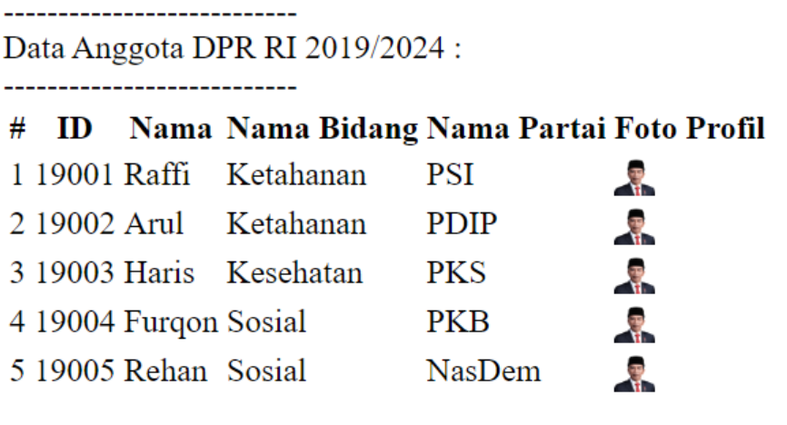
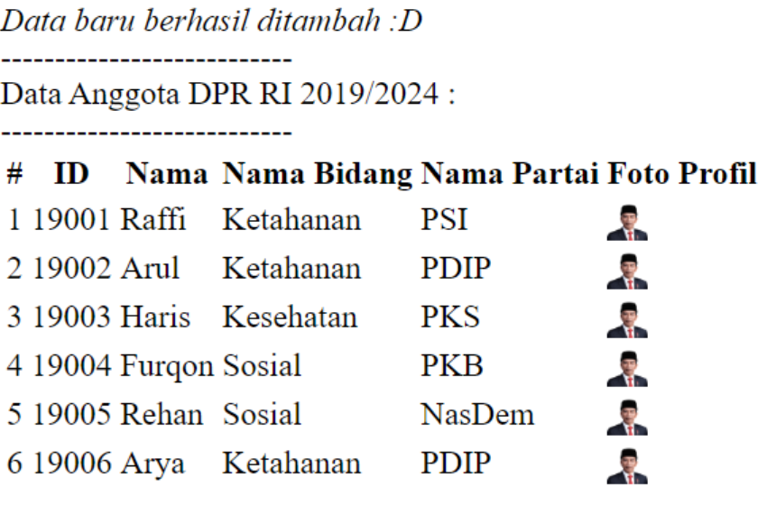
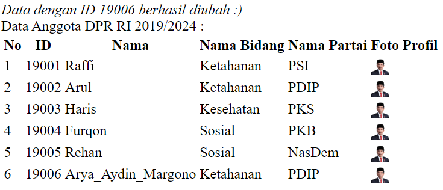
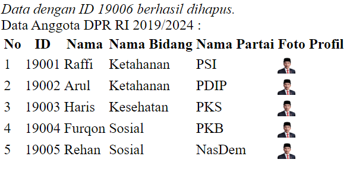

# Sistem Manajemen Data Anggota DPR

## Desain Program
Program ini mengelola data anggota DPR Republik Indonesia untuk periode 2019/2024. Ini memungkinkan pengguna untuk melihat, menambah, mengedit, dan menghapus data anggota.

Program ini memiliki 6 kolom yaitu kolom nomor, ID, nama anggota, nama bidang, nama partai (7 kolom untuk bahasa PHP dengan tambahan kolom foto profil).

## Struktur Program

### 1. Kelas Human
- Mewakili seorang anggota DPR.
- Berisi atribut: ID, nama, nama bidang, nama partai (dan foto profil dalam bahasa PHP).
- Menyediakan metode untuk mendapatkan dan mengatur atribut.

### 2. Kelas Main
- Menjalankan logika utama program.
- Menampilkan tabel anggota DPR.
- Memungkinkan pengguna untuk menambah, mengedit, dan menghapus data anggota.

## Cara Menjalankan
1. User akan diperlihatkan data anggota DPR berbentuk tabel, dan dibawahnya ada beberapa opsi untuk menambah, mengedit atau menghapus anggota.
2. Pilih opsi dengan memasukkan input yang berupa angka (1 mewakili opsi menambah data, 2 mengubah data, 3 menghapus data, 4 keluar dari eksekusi program).
3. Jika memilih input 1, maka selanjutnya user akan diarahkan untuk memasukkan data-data anggota baru (ID, nama, nama bidang, nama partai, foto profil). Setelah mengisi, maka user akan mendapatkan notifikasi bahwa data sudah terinput.
4. Jika memilih input 2, maka uer akan diminta memasukkan ID dari anggota yang ingin diubah datanya. Jika datanya ditemukan, selanjutnya user akan diminta memasukkan data baru dari anggota tersebut namun IDnya tidak diubah.
5. Jika memilih input 3, maka user akan diminta memasukkan ID dari anggota yang ingin dihapus datanya. Jika datanya ditemukan, maka data tersebut akan dihapus.
6. Jika memilih input 4, maka user akan langsung keluar dari program.

## Dokumentasi Saat Program Dijalankan

### Tabel Awal

### Menambah Anggota

### Mengedit Anggota

### Menghapus Anggota

